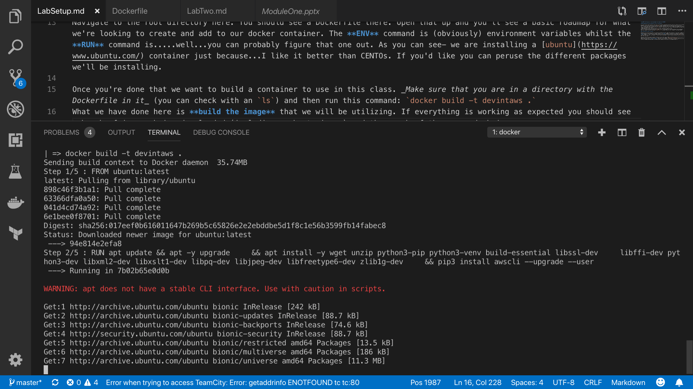
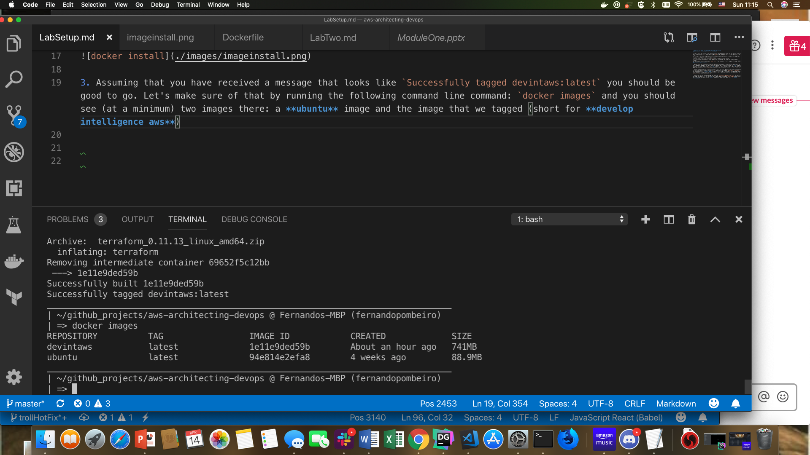
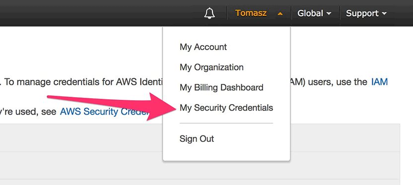
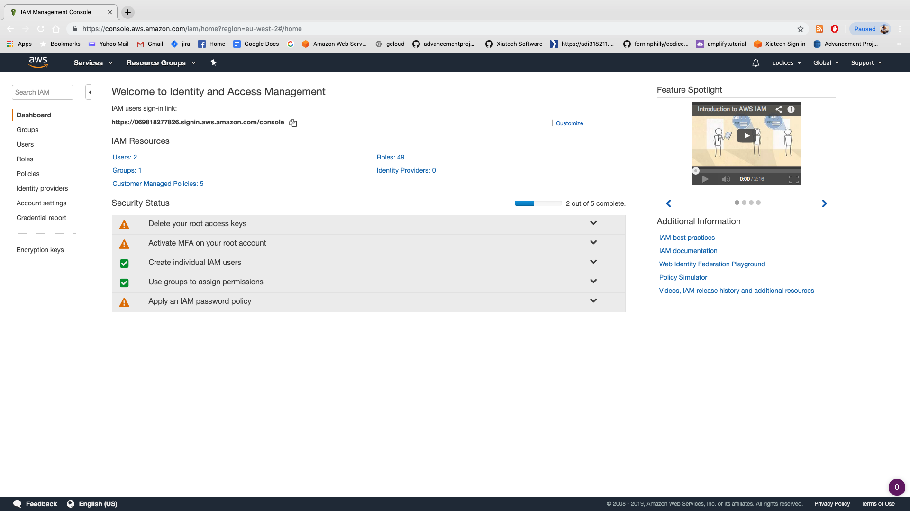
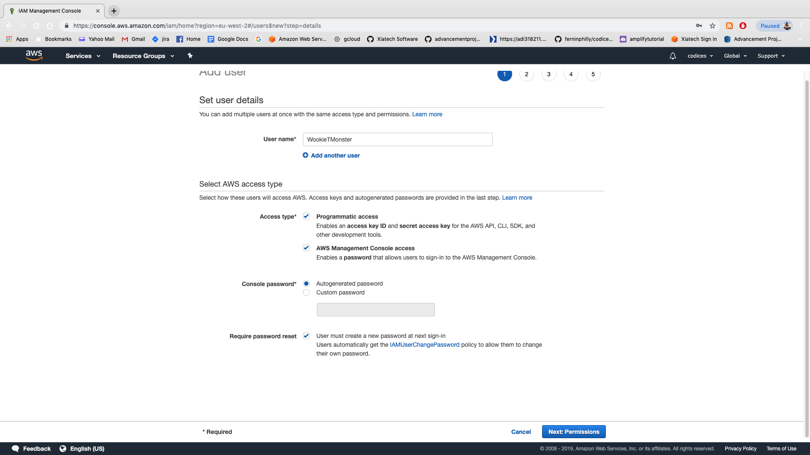
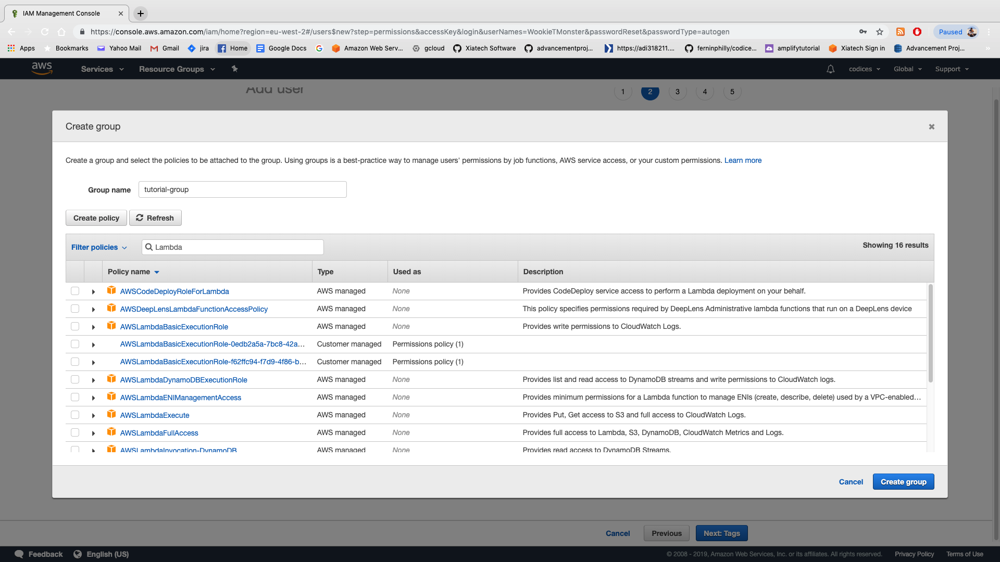
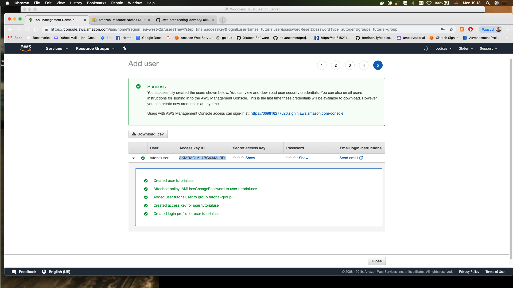

# Lab Setup

## Setting up your local development environment with Docker

### Downloading and installing docker on your local machine

As a way to ensure that everyone in the class is utilizing the same Operating System (and thus reducing issues with Mac vs Windows vs Linux stuff) we will be utlizing [Docker](https://www.docker.com/) to create "mini vms" for all of us.
Yes...I'm aware that docker containers are *not* vms. What I'm actually after here is simply a thin image that allows us all to be on the same OS. This should save time for us down the road as we all won't have to download Vagrant and heavy ISO images to get everything running.
To download Docker on your local machine go [here](https://www.docker.com/get-started)
Once it is installed you should see a docker image in your "running apps" bar (on mac and windows they are different).
Open up a command line editor and type in `docker info`. If you get a bunch of stuff- congrats! You've got DOCKER!

#### Creating your docker container

1. Navigate to the root directory of this github repository. You should see a Dockerfile there. Open that up and you'll see a basic roadmap for what we're looking to create and add to our docker container. The **ENV** command is (obviously) environment variables whilst the **RUN** command is.....well...you can probably figure that one out. As you can see- we are installing a [ubuntu](https://www.ubuntu.com/) container just because...I like it better than CENTOs. If you'd like you can peruse the different packages we'll be installing.

2. Once you're done that we want to build a container to use in this class. _Make sure that you are in a directory with the Dockerfile in it_ (you can check with an `ls`) and then run this command: `docker build -t devintaws .`
What we have done here is **build the image** that we will be utilizing. If everything is working as expected you should see a bunch of images being downloaded (including a ubuntu image) and then each of the commands being run. It should look something like this:


3. Assuming that you have received a message that looks like `Successfully tagged devintaws:latest` you should be good to go. Let's make sure of that by running the following command line command: `docker images` and you should see (at a minimum) two images there: a **ubuntu** image and the image that we tagged (short for **develop intelligence aws**)


4. Now let's run the image as a container. To do that we'll run the following command:
`docker run -ti --rm --name devintcont -v ${PWD}/app:/app <copy-the-image-id-of-the-devintaws-here> /bin/bash` This basically creates the container and mounts the /app folder in there (so whatever code we put in **app** ends up in the container). Quick notes:

    * The **t** option allocates a psuedo-tty 
    * The **i** option keeps STDIN open
    * The **v** option mounts the app directory in the present working directory to the app directory in the container
    * The `/bin/bash` at the end allows us to enter a bash shell.

5. Hopefully at this point you see a new username on your shell. Congratulations! You're in the docker container. Try running some ubuntu commands (`apt-get update`-- should run quick because we updated in the dockerfile). Now the next step is to make sure that we have the packages that we need:

    a. `terraform -v` should return a terraform version
    b. `python3` should return a python shell
    c. `aws --version` should return an aws version

6. Congratulations! We have a working container! Let's get set up on AWS! 

7. Oh yeah, and `exit` from the container.

#### Now let's get set up on the AWS free tier

1. For the next step we're going to set up our AWS accounts. This should be pretty straightforward and I'm not going to cover everything here...suffice to say please make sure that you have an aws [account](https://portal.aws.amazon.com/billing/signup#/start)

2. Head to your [aws-management-console](https://console.aws.amazon.com). This is an excellent list of all of the available services. What we need at the moment is our aws_secret_keys and aws_access_keys from the services list here. Fortunately (as of March of this year) AWS has created a single location to find these items: in the top right hand corner of your screen under your username:


3. NOW- as part of this lab we are going to use a best practice for aws managers and, instead of utilizing the **root user** we're going to take this opportunity to create a separate user for the class. This is excellent practice for when you are creating access for individual users in your organization. 

4. **IF** you want to use the root user to access and create everything for this class (seriously though...don't...it's terrible practice) you can skip ahead. 
But again...seriously: don't do that. Create a user...OTHERWISE managing the root user comes with all of the issues you'd expect (managing permissions, removing/deleting or adding permissions, etc)

5. So let's create a user in the IAM management console. In the **services** search bar at the top of your console page type in **IAM**. That should take you to your IAM console screen:


6. Now we want to create a user. This is actually a pretty easy thing to do- click on the **users** link and click on **add user**

7. Set up your user details as you'd like (make the user name your pet's name or something) and click on **both** Programmatic access and AWS Management Console access. Feel free to leave console password and require password resource checked off (this is what you will probably be doing when you create accounts for your devs).


8. Go to ADD USER TO GROUP. Here is where we would create a group for our users if we had a group we wanted to add them to (so, for instance, like "Accounting" or "Junior Devs" or something). Click on "Create Group" and you'll see a list of **policies**.

9. These are pre-built policies that AWS has been kind enough to create for us. In the Group Name bar type `tutorial-group`.

10. IN the search bar next to **Filter policies** do a search for **Lambda** functions. You should see something like this:


11. Click on the **AWSLambdaBasicExecutionRole** and you can see there the basic JSON structure around how policies are dictated. One thing to notice here is the **"Resource": "*"** at the bottom. If you add the **arn** of a resource (a lambda function, DynamoDB table, EC2 instance or Redshift db) to this resource section then the policy will apply __only__ to that resource (and you can have multiple resources there if you wish):


12. For now let's start by giving our user access to s3 (to start). Yes- it's possible to give **AdministratorAccess** to a user but this is not advised for anything less than your most senior developer (or someone you really, really trust). For now we're going to be adding permissions one at a time in order to get a tightly controlled user set up.


13. So let's start with just s3.... grant full access to AmazonS3FullAccess by clicking on **Amazons3FullAccess** and then clicking **create Group**

14. Click on **create Tags**. Do this if you want...it's pretty self explanatory. Next click **Next: Review** and then **Create User**

15. __Voila__: you have created your first user! Congratulations. __Do Not Click Beyond This Page Until You Have Downloaded the Secret and Access Keys In CSV format__


16. Download the csvs. **These contain your secret and access keys and need to be kept secret!**

17. So now we have our aws keys. At this point I want to show you how to set up the credentials on your host machines...which you'll want to do with your root access credentials to effectively utilize the aws cli.

#### Managing keys on your host machine

1. Our next step is to set up our keys locally so that we can use them with the AWS CLI. Fortunately the aws cli makes this extremely easy. If you have not yet installed the aws CLI on your local host machine __and only if you want to__ Click [here](https://docs.amazonaws.cn/en_us/cli/latest/userguide/install-windows.html) for windows install instructions and [here](https://docs.aws.amazon.com/cli/latest/userguide/install-macos.html) for mac instructions. 

2. There are several ways to manage our aws keys that allow us to effectively use them for the AWS command line interface. We're going to demonstrate two separate methods here- one for your host and one for the docker container:
    
    a: For managing keys on your **host** machine simply type `aws configure` into your command line. This will bring up a command line that asks for your aws access key ID. Go ahead and copy that from the .csv you downloaded and hit enter.

    b: Same thing for the Secret Access Key

    c: For default region type in `eu-west-1` (for Ireland)

    d: For default output format choose JSON

    ...and __voila__! We have a working aws configuration! To check on it:

    a: On MAC type `cat ~/.aws/credentials` and you should see something that looks like this: 
        ```
        [default]
        aws_access_key_id = 123PLEASEDoNtHACKME
        aws_secret_access_key = EKOERJKOEREROIER*#$#$@$##$
        ```
    b: On WINDOWS navigate to `C:\Users\USERNAME\.aws\credentials` and you can open the file in the text editor.

Now- much like anything else- you guys might want to, over time, add in other credentials to these basic ones. Right now these credentials are listed as `default`. Let's upgrade that by creating them as a "profile"...which is also simple: type in `aws configure --profile tutorial` and go through the process again. When you open up the credentials again you should see a new profile header: **[tutorial]** there. When we run commands from the CLI using this profile we simply need to append a `--profile tutorial` to the end.

#### Managing credentials on your Docker Container

As Docker containers are intended to be ephemeral the management of AWS keys is somewhat different here...though this also works for your host machine.
Basically...any time a command is run from the AWS cli there is a search done for the following environment variables:

1. AWS_ACCESS_KEY_ID
2. AWS_SECRET_ACCESS_KEY
3. AWS_DEFAULT_REGION

So you can always `export AWS_ACCESS_KEY_ID=yourkeyhere` to add the appropriate access key for the session you are working on. 
To add environment variables to docker containers you have two options- less ideal and more ideal. 
The less ideal option is that you can use named environment variables in the dockerfile...in other words:
`ENV AWS_ACCESS_KEY_ID HereIsMyAccessKey`

This is not ideal, however as that means that you can't commit your Dockerfile...which is terrible. What I usually recommend instead is either mount the keyfiles directly into the container OR pass them in as -e environment variables when we run the container...so:
`docker run -ti --rm --name devaws -v $HOME/aws-architecting-devops/app:/app -e AWS_ACCESS_KEY_ID=YOURACCESSKEY -e AWS_SECRET_ACCESS_KEY=YOURSECRETKEY <YOURIMAGE>`

Once you've done that it might be worth adding that to your ~/.bash_profile (or whatever windows uses). 

Now that we're set up for success let's get started!


