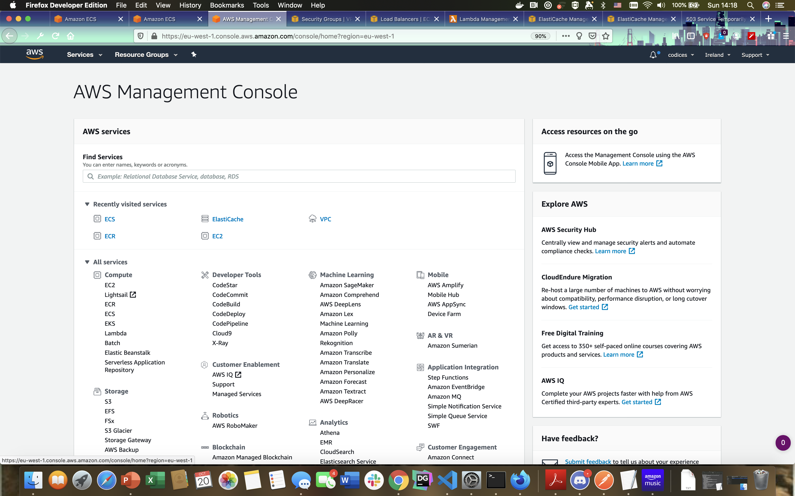
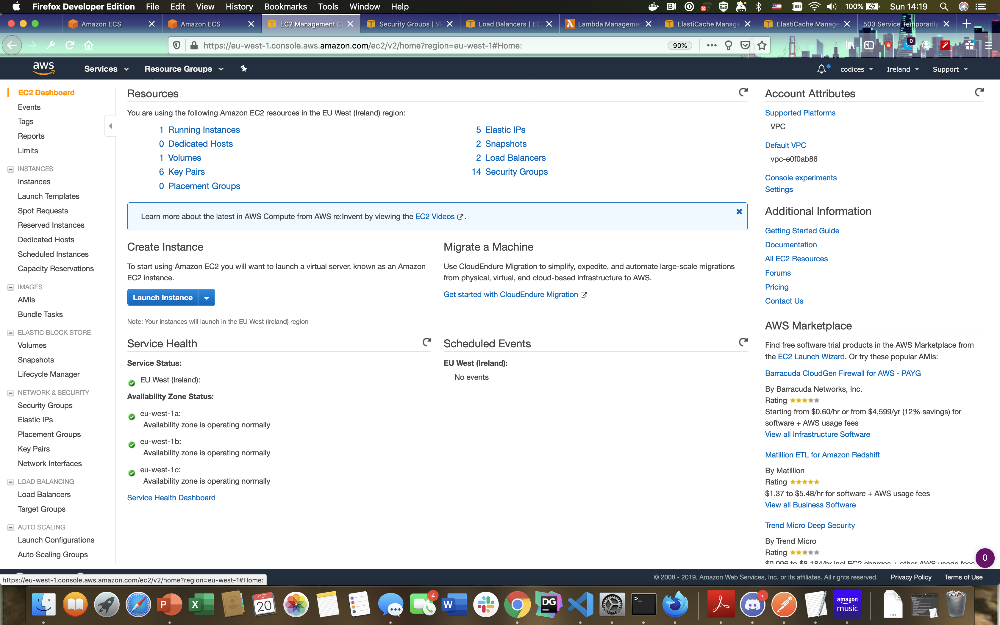
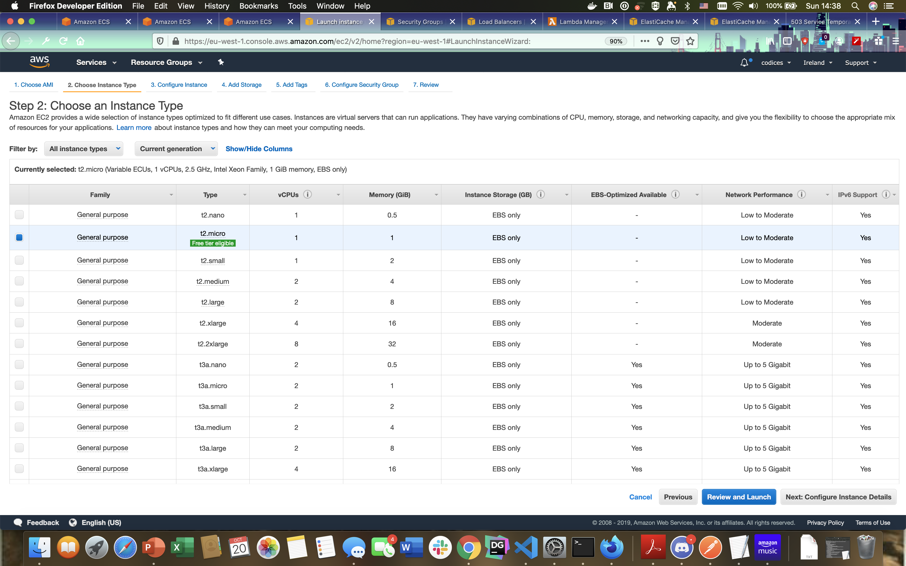
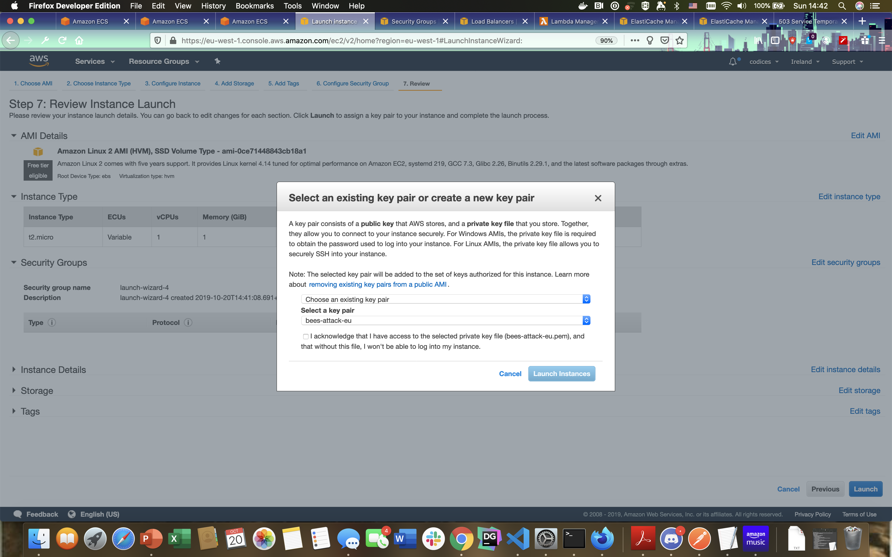
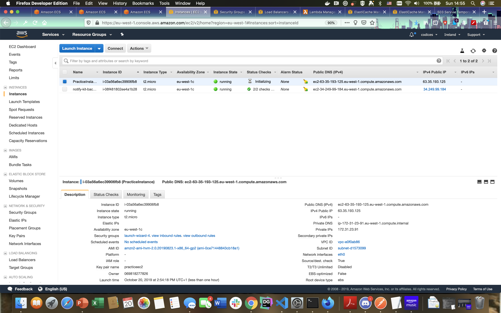
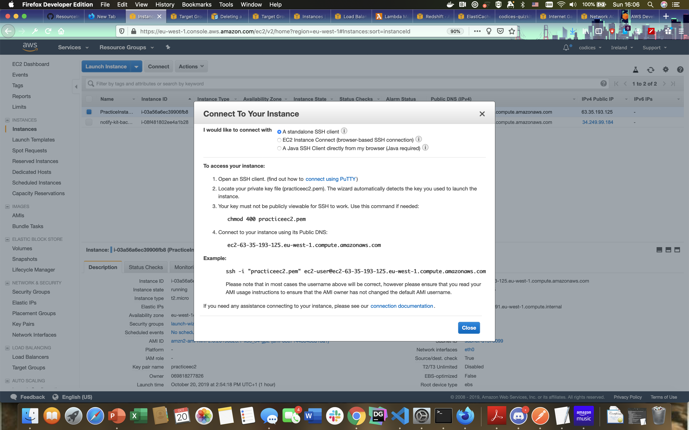
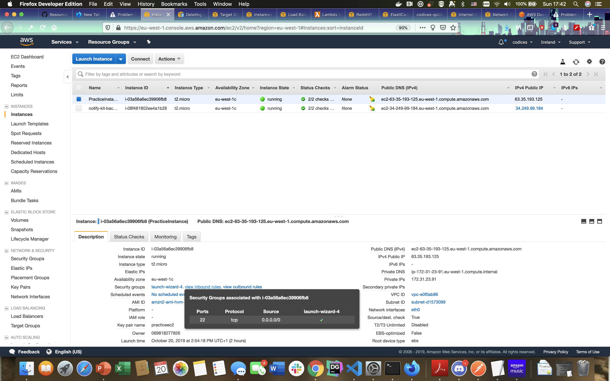
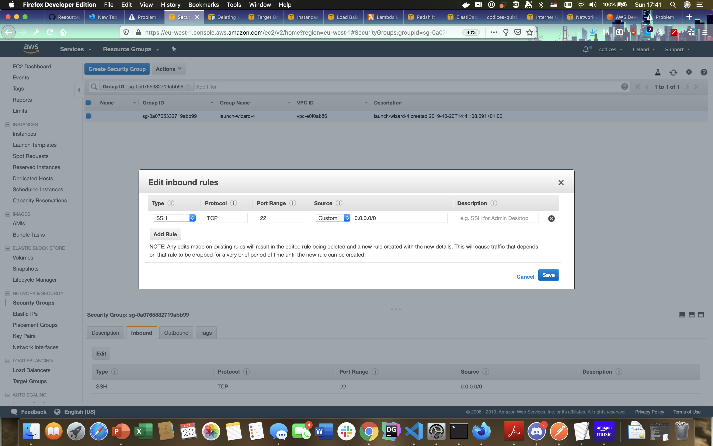

# DevOps LabTwo: Creating our first EC2 instance

1. SO...as we've been talking about previously let's get into how we are going to create some basic resources in AWS.

2. AWS resources can be created in one of two ways:

  * On the command line
  * From the **management console**

3. We're going to start by creating a basic ec2 instance via the management console. This is the quickest and easiest way to spin up a virtual machine.

4. Navigate onto your AWS account by logging in manually. That should bring up a screen that looks like this:



5. In the search bar type in "ec2". This will bring up the ec2 screen:



6. Now we'll go over a quick review of this screen that will show us everything we might be interested in.
  * On the left side we have kind of a "list of services offered by EC2- including load balancers, and auto scalers
  * In the middle we have a full list of all of the services currently running including the number of instances.
  * We have the big, fancy, blue "Launch INSTANCE" button there. Let's launch an instance...


  7. Now...for this example let's go with a basic AWS instance that we want to launch. This will give us an idea of how we create, one at a time, a very basic EC2 instance for use in AWS. Amazon offers a basic AMI (Amazon Machine Image) that is compatible with RHEL.

  8. Choose the top option (Amazon Linux 2) and the FREE-Micro Instance (for free micro-tier).



  9. Obviously the micro-tier will not fit your needs 100% of the time but we are just here to do a quick demo of what this system will look like....

  10. On the next page we can put our system inside things like "security groups" which tie back to our VPC networks which we'll get into in the next module. For now just stick with the defaults and let's launch this thing...

  11. The next screen to come up will be a popup that will invite you to create your ssh key.
  Now- your ssh key is basically the thing on your computer that allows access to this system. Think of it as the computer-password that allows access (you use ssh keys when you are pushing to github for example). The system is saying to you here "okay- fine...I'll create this instance but how do you want to access it??"

  

  12. If you need to create an ssh key (depending on the type of system you are using) you can do it manually OR you can choose to "Create a new keypair" from the drop down. Let's go ahead and create a new keypair. Save the keypair as a PEM.

  13. Now, and this is an important side note, **assuming that you were creating this machine for a separate user you would have to pass them the keypair for them to be able to access their bright, fancy new virtual machine**

  14. Click the acknowledgement and then **Launch instances**. This part will take a few minutes while your instance provisions.

  15. While the instance is being created let's go ahead and add a name for it (anything you'd like..."Practice instance" or something...)



  16. Let's also take this opportunity to take a quick look at the section in the bottom half. There are a couple of things in this section that we need to take note of...

  * **Security Groups:** This is how you will control access to your virtual machine instance (going forward known as your ec2 instance). 
      * Click on the "View Inbound" and "View Outbound" rules to take a quick look at how those are interacting with the "outside world". We'll come back to this later but it's essential to understand how these are working. 
  * **Public DNS**: This is the default web address that is facing the "outside world". If you have this server added to a network somewhere then THIS is the "phone number" for how you will call this instance up.

  17. Anyways- hopefully within a reasonable timeframe our instance has launched! Let's take a quick look around! Right click on the instance and you should get a popup that looks something like this:

  

  18. SO....this is telling us a couple of things:
  
  * ONE thing this is telling us is that our ec2 instance will work with our PEM key that we downloaded...which is good news. 
  * The other thing it's telling us is that our PEM key must have a minimum security setting (that's what the **chmod** does- changes the permission around the key file. Must be at 400- which makes it pretty darn secure)

  18. Let's go back onto our host command line and navigate over to the downloads folder where, presumably, our key has landed when we downloaded it. Let's apply each command (Now- if you are on windows you will need to enable BASH. Instructions to do that can be found [here](https://stackoverflow.com/questions/36352627/how-to-enable-bash-in-windows-10-developer-preview))

  19. Let's apply that command (might need *sudo* to get it working) to get our key up and running. 

  20. Once your key is ready let's go into our ec2 instance by running (from the same folder) the ssh command you had above. For me it was: 
  `ssh -i "practiceec2.pem" ec2-user@ec2-63-35-193-125.eu-west-1.compute.amazonaws.com`

  ## Managing your instances

  1. SO...now we have a simple way to create a single instance. Awesome...however how useful is this for our development environment? 

  2. SO...as you guys probably realize by this point...most of DEVOPS is concerned with **state**...as in the **state** of your server. When you think about it, about 80% of the issues that devops run into are struggles with creating servers that are just *slightly* different that cause massive issues. 

  3. Over time we've come up with complex and difficult ways to deal with this problem of **state**. Obviously going in and creating these servers one-at-a-time with scripts can get painful. IF ONLY there was a way to make this easier!!

  4. Let's hop on and run the following commands: 

  ```
  sudo yum install -y python37
  curl -O https://bootstrap.pypa.io/get-pip.py
  python3 get-pip.py --user
  pip install ansible --user
  ```

  5. Now...we'll come back to the ansible thing in a bit. In the meantime let's do this manually....run the following: `sudo yum -y install httpd && sudo yum -y install httpd`

  6. This will install and restart an apache2 webserver locally for you. Let's let that happen and then see if we have access to it. Run this command locally: `curl localhost`. If you get back a tonne of html then congrats! You're running a webserver. 

  7. Let's do something a little more interesting here. Copy this code below and then do the following: 

* Copy this:
```html
<!DOCTYPE html>
<html>
<body>

<h1>YOU DID IT!!!</h1>
<p>
    <iframe src="https://giphy.com/embed/3Mj1dgCH2P2a7cjbnZ" width="480" height="480" frameBorder="0" class="giphy-embed" allowFullScreen></iframe><p><a href="https://giphy.com/gifs/beer-cheers-guinness-3Mj1dgCH2P2a7cjbnZ">via GIPHY</a></p>
</p>

</body>
</html>
```

8. Then do this on the commabnd line:

```bash
cd /var/www/html
sudo vi index.html
```

9. Once in the index.html we're ready to paste. Hit **esc** and then type `:set paste` and then type **ctrl-v** to paste the contents of your clipboard into index.html. Once it's in there hit the **esc** key again and type `:wq` at the bottom. You should be all set.

10. Restart your httpd apache service with `sudo service httpd restart`

11. Now run `curl localhost` again and see what comes in for you. If you got your index.html you're all set! 

12. BUT...now we have to make sure that our webserver is accessible from the outside!! **How do we do this??**

13. Go back to your management console. Let's see if we have access from **outside** of this instance! Go to your ec2 address: **ec2-63-35-193-125.eu-west-1.compute.amazonaws.com** (for me)


14. NOW...this doesn't seem to be working. *Why do you think this is??*

15. Navigate over to the **security groups** section of your ec2 instance and let's take a look at what's there. Do you see the security groups? Click on **view inbound rules**



16. So...we have some issues. Unless we're coming in through port 22 we're getting NOWHERE on this site and, considering that the http default port is **80** it is doubtful that we'll be able to get in via port 22. ERGO....*we need to open up port 80!*

17. So let's click on the **security group** to the left of that (possibly called **launch wizard** or something similar). Once you are in there take a quick look at the **inbound** tab at the bottom of the screen. Obviously we want to **edit** that one to allow traffic in through port....well...let's just let ALL traffic in...



18. So let's open that up on **all tcp** images to **anyone**.
(Hopefully you can see where this would be a SUPER useful tool for network security!)

19. Once that's done go back and try refreshing the site that points at your EC2 instance. **How's it looking now??**

20. CONGRATULATIONS!!


