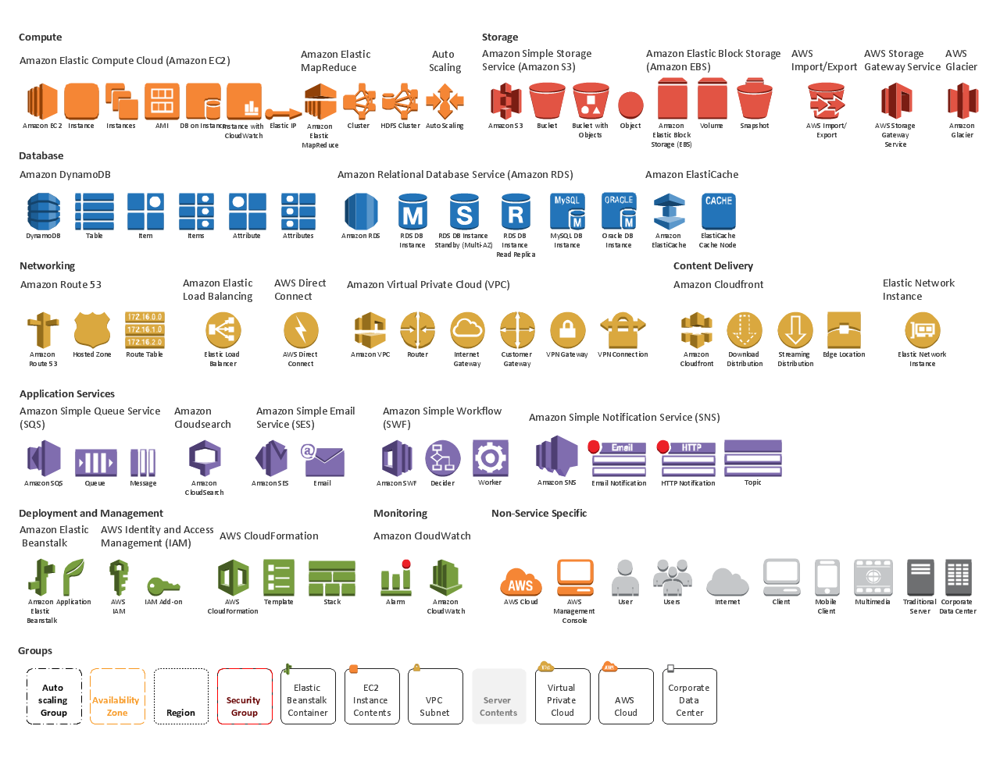

# Lab Four: Deploying an application with Terraform

## Introduction

So here's the scenario: your team has come to you and stated that they want to create a crap movie application in AWS. The garbage-film application must be **serverless**. It will have a **front end**, a **back end** and communication between them will be handled via an api. It will live in a VPC with web access. This will be the situation through the next two modules

You, being the genius AWS architect that you are, immediately think through the following:

1. Let's break down the problem: The first issue is that we need two halves: a front end to serve to the public and a back end to contain the api. How should we do this? What are our options? How can we draw this up? Go back to the lesson that we just had and name some options. The first **challenge** here is for everyone to draw up a basic idea of what we'd be looking for. Create a model that looks something like this:


Using icons found here:



We want to use **DynamoDB** as the back end and host the application on **s3**. Let's break it down into each of it's component parts: the FRONT END and the BACK END:

## Back end deployment

Let's start with the back end.

So basically your first **challenge** in this module is to create an architecture diagram. Well- TWO architecture diagrams, actually: One for the **front end** and another for the **back end**. Don't forget your VPC! Write out each of the elements in each of the portions of the application. Do a basic drawing of this on notepad and paper. This should be a relatively simple app so please don't overthink it. 

2. Now that you have an architecture diagram you should have each of the elements:

* **DynamoDB** as the database in the back end
* **Lambda** functions to serve the application (serverless)
* **A VPC** with web access to network all of this together
* **S3 buckets** to manage file uploads and downloads
* **API Gateway** to manage the API between the backend and front end

We're going to deploy all of these elements with **terraform** to our AWS account and then utilize them to run the application live. 
All of the code has been written (in node/react) and can be found in the **./module_04/badmoviesapi** directory. Let's get to work on terraform!

3. For the next challenge in this section everyone should go through and deploy this lambda function (google is your friend). The code can be found in the **scanlambda** directory that we want to deploy. So how should we do this in terraform? What are the steps? let's go through enough to get started and then I will leave it to you guys to write the terraform documentation...

4. SO- to deploy the first thing we'll want to do is get the file zipped down. Before we start with that let's start with a basic practice run! Since we're doing bad movie quotes let's do a basic one from troll 2 (if you haven't seen troll 2.....[don't](https://www.youtube.com/watch?v=HyophYBP_w4)). You might have noticed that there is a **troll2** folder here...so let's do that:
`cd troll2 && zip ../troll2.zip main.js`
You should see a new file called "troll2.zip" appear in your "badmoviesapiscan" directory. The next challenge for you guys to answer here: **How could I automate this process for the programmers?** (maybe a type of file that _makes_ things in this directory?)

5. Now we need a place to deploy this local package. This is going to be the one section where we are not going to use terraform but instead just create an s3 bucket with the AWS CLI. Type in the following:
`aws s3api create-bucket --bucket=badmovieapiexample --region=us-east-1 --profile ENTERYOURPROFILE`

6. Head into the console to check that the bucket has been created. Assuming you see the bucket (don't forget the region!) we should be good to go. Let's put our zipped file in there.

7. Now let's copy our file into our s3 bucket. Again...we will be doing this not through terraform but through the comman line. My recommendation is that when in production you create a MAKEFILE and a "build-all.sh" file that will automatically do these steps:
`aws s3 cp troll2.zip s3://badmovieapiexample/v1.0.0/troll2.zip --profile YOURPROFILE --region us-east-1`

8. Now your file is zipped and in s3 and ready to be deployed by terraform (again- check on the console). Some might wonder **why** we are adding in the 1.0.0 there...well...you want to keep versioning in case you need to redeploy an old version because a new one got screwed up! 
Anyways- let's start on the terraform section!
This is your next **Challenge**. START with the initialization (which you know) from which you will need the **provider**. 

9. The next thing you'll need is the **resource** which should be **aws_lambda_function**. We should also take care of the **iam_role** here. We'll also want some logs to keep so let's add those as well. I have an example of these in the **./terraform_answers/lambda.tf**. You can use these as a starting point. Take a look at that file and move it where appropriate. This should be ready to go. 

10. Now it's time for our three step process:
`terraform init`
`terraform plan`
`terraform apply`

11. If all went well you should see a lambda in your console. Check now. ALSO- let's see if it worked! `aws lambda invoke --region=us-east-1 --function-name=Troll2Quote --profile codices output.txt && cat output.txt`

12. Did that work? You should see your HTML returned. NOW let's add in an **api gateway** to our lambda! This is another resource (like VPCs) that might require it's own file- so add in a **apigateway.tf** file to your **./terraform** file and let's get started!

13. Paste this into your **apigateway.tf**

```
resource "aws_api_gateway_rest_api" "troll2gateway" {
  name        = "BadMovieAPIGateway"
  description = "This will be our rest API for bad movies eventually"
}

resource "aws_api_gateway_resource" "proxy" {
  rest_api_id = "${aws_api_gateway_rest_api.troll2gateway.id}"
  parent_id   = "${aws_api_gateway_rest_api.troll2gateway.root_resource_id}"
  path_part   = "{proxy+}"
}

resource "aws_api_gateway_method" "proxy" {
  rest_api_id   = "${aws_api_gateway_rest_api.troll2gateway.id}"
  resource_id   = "${aws_api_gateway_resource.proxy.id}"
  http_method   = "ANY"
  authorization = "NONE"
}
```

14. So what we've done there is created our gateway resource first and then added in two proxy methods. NOW- as you might have noticed in the second proxy method there is an ANY there. You can make this a "GET", "POST", "PUT", "DELETE" etc as desired for http if you wish. The first method there is for the path (it can be "api/v2/whatever" or whatever...in this case we're doing the path as "ANY" with NO auth required). Now we need to bring these two resources together with an **integration** resource as follows:

```
resource "aws_api_gateway_integration" "lambda" {
  rest_api_id = "${aws_api_gateway_rest_api.troll2gateway.id}"
  resource_id = "${aws_api_gateway_method.proxy.resource_id}"
  http_method = "${aws_api_gateway_method.proxy.http_method}"

  integration_http_method = "POST"
  type                    = "AWS_PROXY"
  uri                     = "${aws_lambda_function.troll2lambda.invoke_arn}"
}
```

This is basically how we're tying everything back to our lambda function. NOW- there is a minor issue in that api gateway has trouble with calling the **root** (index.html usually) of a web app. So the order is: gateway->proxyResource->PATH. Well- right now our PATH is blank! We need some ROOT resources and so...

```
resource "aws_api_gateway_method" "proxy_root" {
  rest_api_id   = "${aws_api_gateway_rest_api.troll2gateway.id}"
  resource_id   = "${aws_api_gateway_rest_api.troll2gateway.root_resource_id}"
  http_method   = "ANY"
  authorization = "NONE"
}

resource "aws_api_gateway_integration" "lambda_root" {
  rest_api_id = "${aws_api_gateway_rest_api.troll2gateway.id}"
  resource_id = "${aws_api_gateway_method.proxy_root.resource_id}"
  http_method = "${aws_api_gateway_method.proxy_root.http_method}"

  integration_http_method = "POST"
  type                    = "AWS_PROXY"
  uri                     = "${aws_lambda_function.troll2lambda.invoke_arn}"
}
```

And thus we have our root resources! NO need for paths! 

15. Now let's add in a deployment to test it:

```
resource "aws_api_gateway_deployment" "troll2deployment" {
  depends_on = [
    "aws_api_gateway_integration.lambda",
    "aws_api_gateway_integration.lambda_root",
  ]

  rest_api_id = "${aws_api_gateway_rest_api.troll2gateway.id}"
  stage_name  = "dev"
}

```

So this ties our gateways (proxy and root) together and then gives an id to stage "dev" (which you should make a variable in a variables file but we'll skip that for now)

16. Finally we need to give the api gateway **permission** to go after our lambda. So in order to do that we will add this resource to our **lambda.tf** file:

```
resource "aws_lambda_permission" "apigw" {
  statement_id  = "AllowAPIGatewayInvoke"
  action        = "lambda:InvokeFunction"
  function_name = "${aws_lambda_function.troll2lambda.arn}"
  principal     = "apigateway.amazonaws.com"

  # The /*/* portion grants access from any method on any resource
  # within the API Gateway "REST API".
  source_arn = "${aws_api_gateway_deployment.troll2deployment.execution_arn}/*/*"
}
```

17. And finally- to **test** our function we need a URL. Assuming everyone remembers the OUTPUT vars let's append this to our **apigateway.tf**:

```
output "base_url" {
  value = "${aws_api_gateway_deployment.example.invoke_url}"
}
```

18. Let's make one more quick change so that we can control our versioning better (and roll back and forward as necessary!). Remember that _v1.0.0_ that we had in our s3 bucket as a directory? Well- let's add in a **variable** there that we can control easily. Add this to the bottom of the **lambda.tf** file:

```
variable "version" {
}
```
AND let's do this to the directory section in the **aws_lambda_function**:

```
resource "aws_lambda_function" "troll2lambda" {
  function_name = "Troll2Quote"

  # The bucket name as created earlier with "aws s3api create-bucket"
  s3_bucket = "badmovieapiexample"
  s3_key    = "v${var.version}/troll2.zip"
```

AND  NOW when we deploy- when we want to change the version all we have to do is: `terraform apply -var="version=1.0.1"` and when we change that version then THAT'S the version that goes out!

19. Apply changes:

```
terraform plan
terraform apply -var="version=1.0.0"
```

Once this is done click on the URL. What do you see? 
Congratulations on your own small gift to the internet!
__Now imagine doing this with a more complex code base!!__

20. So now we have an application with LAMBDAS and API gateways. Let's move on to making this a **genuine** backend with DynamoDB.

## Deploying our back end (Dynamo)
So now we have the beginnings of our api (we'll deploy the express application in the next section) we'll want to have the back end ready to go. Let's get the DynamoDB section deployed by creating a dynamodb resource in a new **dynamo.tf** folder in your terraform folder:

```
resource "aws_dynamodb_table" "badmovie-dynamodb-table" {
  name = "CodingTips"
  read_capacity = 5
  write_capacity = 5
  hash_key = "Title"
  range_key = "Date"

  attribute = [
    {
      name = "Title"
      type = "S"
    },
    {
      name = "Date"
      type = "N"
    }]
}
```

Now this means, of course, that we will also need an **iam policy** so that we do not run into issues SO... add this to your **dynamo.tf**

```
resource "aws_iam_role_policy" "dynamodb-lambda-policy"{
  name = "dynamodb_lambda_policy"
  role = "${aws_iam_role.lambda-iam-role.id}"
  policy = <<EOF
{
  "Version": "2012-10-17",
  "Statement": [
    {
      "Effect": "Allow",
      "Action": [
        "dynamodb:*"
      ],
      "Resource": "${aws_dynamodb_table.badmovie-dynamodb-table.arn}"
    }
  ]
}
EOF
}
```

21. Congratulations! You should have a working infrastructure set up! The next thing we need to do is associate all of these pieces with our previously created VPC for network security purposes!

### Adding in our VPC layer

1. So we now have the skeleton of what we want to deploy BUT- we are seriously lacking in two areas (from the previous section): **Monitoring** and **Security**. So we're going to use one of the biggest advantages of terraform which is the ease with which we can move these pieces around and create associations with ease. **AS AN ARCHITECT** it is important that you control these pieces and ensure that everything that is being deployed in this code base is associated to a proper, secure VPC and IAM role. 

2. In that thinking let's `cp ./module_03/labanswers/terraform/vpc.tf` into this directory (and just like that! We have a vpc!).

3. Along with these we'll also need some variables to come over so let's create our **variables.tf** document and add these three (from module 3):

```
variable "vpc_cidr" {
  description = "CIDR for the VPC"
  default = "10.0.0.0/16"
}

variable "public_subnet_cidr" {
  description = "CIDR for the public subnet"
  default = "10.0.1.0/24"
}

variable "private_subnet_cidr" {
  description = "CIDR for the private subnet"
  default = "10.0.2.0/24"
}
```

3. Now let' associate our lambdas with the vpc by adding in the SUBNET IDs and SECURITY GROUPS to the lambdas:

```
  vpc_config {
      subnet_ids = ["${aws_db_subnet_group.beastmastersubgroup.subnet_ids}"]
      security_group_ids = ["${aws_security_group.sgweb.id}"]

  }
  ```

  And we should be good to go! 

  4. Run your plan/apply again and we should have an operational front and back end. As long as this is working and you can see the advantages go ahead and `terraform destroy` this section an we'll move on to the next one.

  5. The **takeaway** here is the ease with which you can associate different code aspects in a VPC as well as how you would manage making sure that your infrastructure as code is working. Managing terraform and ensuring that it is working is a bit of a beast- but it's worth it if you can get these things working correctly and it's essential to the SECURITY pillar of your **well architected framework**.
