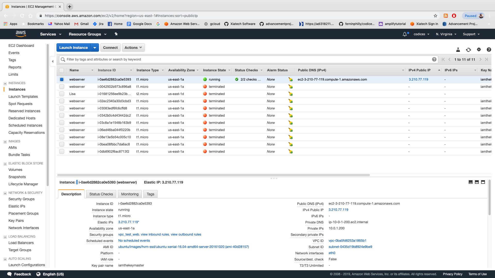
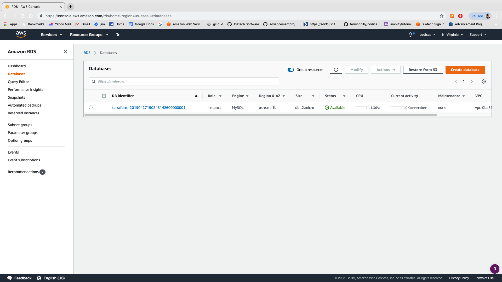
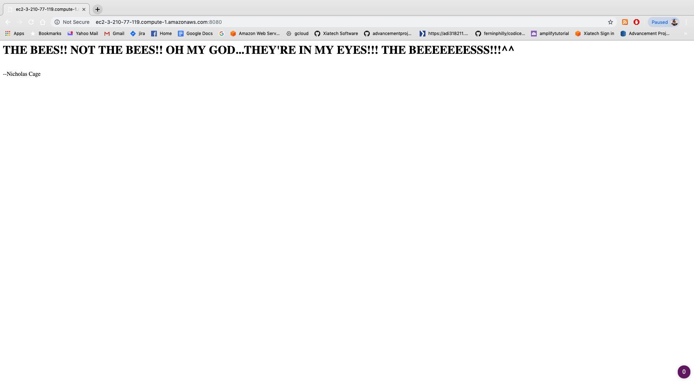

# Lab Three: Creating our first VPC with Terraform

The first step to creating a stack is to set up the VPC inside which we'll deploy all of our assets. The next thing we'll want to do after that is set up the s3 buckets that will keep our **stored** data. 

### Managing our terraform variables

One of the most important aspects of managing multiple terraform instances is to abstract out as many variables as possible. Much like in coding we want to use dependency injection where possible. The ideal state is one where developers can just alter the __variables.tf__ file and all of the other templates are written externally to that. 
So considering this: in your **./terraform/variables.tf** directory paste this code in:

```
variable "aws_region" {
  description = "Region for the VPC"
  default = "us-east-1"
}

variable "vpc_cidr" {
  description = "CIDR for the VPC"
  default = "10.0.0.0/16"
}

variable "public_subnet_cidr" {
  description = "CIDR for the public subnet"
  default = "10.0.1.0/24"
}

variable "private_subnet_cidr" {
  description = "CIDR for the private subnet"
  default = "10.0.2.0/24"
}

variable "ami" {
  description = "Amazon Linux AMI"
  default = "ami-4fffc834"
}

variable "key_path" {
  description = "SSH Public Key path"
  default = "<put in the full path to your ssh public key>"
}
```

Obviously we have to replace the key_path in the variable immediately above. 
The ssh key there is so that we can ssh into our ec2 instance once it's created. The CIDR blocks are attached to the two subnets that we've defined.

### The VPC resource
Now let's create a separate file for the VPC itself in the same terraform directory. Let's call it **vpc.tf**. For more complex resources I'd recommend putting them into their own file (and as VPCs are a complex and semi-permanent resource this is where you'll want to put it). In this file we'll start creating our resource:

```
# Define our VPC
resource "aws_vpc" "devintelpractice" {
  cidr_block = "${var.vpc_cidr}"
  enable_dns_hostnames = true

  tags {
    Name = "devintelpractice"
  }
}
```

The thing to note here is the **enable_dns_hostnames** tag: essentially this means that we want our vpc to assign dns names to resources (like ec2 instances) in there.

Now- in the same file, let's add subnets! As we've decided to create a webserver instance we're going to create TWO: One **private** subnet (so available only to other resources **within** the vpc...resources like, say....a database?) and a **public** subnet that will allow people to access our VPC via an **internet gateway**. We're going to use the CIDR blocks we defined in our variables. ALSO note the two **availability zones**. 

```
# Define the public subnet
resource "aws_subnet" "public-subnet" {
  vpc_id = "${aws_vpc.devintelpractice.id}"
  cidr_block = "${var.public_subnet_cidr}"
  availability_zone = "us-east-1a"

  tags {
    Name = "PUBLIC subnet"
  }
}

# Define the private subnet
resource "aws_subnet" "private-subnet" {
  vpc_id = "${aws_vpc.devintelpractice.id}"
  cidr_block = "${var.private_subnet_cidr}"
  availability_zone = "us-east-1b"

  tags {
    Name = "PRIVATE Subnet"
  }
}
```

Now we want to associate these subnets together into a group to establish the NAT communication between them: 

```
resource "aws_db_subnet_group" "beastmastersubgroup" {
  name        = "beastmaster-subnet-group"
  description = "Terraform example RDS subnet group"
  subnet_ids  = ["${aws_subnet.public-subnet.id}", "${aws_subnet.private-subnet.id}"]
}
```

Note the use of the `${aws_vpc.devintelpractice.id}` here. **aws_vpc** is the resource and we're simply calling the **default.id** from there (as the resource is created and we don't need to worry about order due to the append-ing nature of terraform files in this directory). 
So now that we have a public and private subnet setup the last thing we need to be able to access resources inside the vpc from the outside is our **internet gateway** which we will set up thusly:

```
# Define the internet gateway
resource "aws_internet_gateway" "gw" {
  vpc_id = "${aws_vpc.devintelpractice.id}"

  tags {
    Name = "VPC IGW"
  }
}
```

Same use of the devintelpractice id from the created **aws_vpc** resource. Now we have an internet gateway that can speak to the private subnet through a **NAT gateway**. Final step is that we need a **route table**:

```
# Define the route table
resource "aws_route_table" "web-public-rt" {
  vpc_id = "${aws_vpc.devintelpractice.id}"

  route {
    cidr_block = "0.0.0.0/0"
    gateway_id = "${aws_internet_gateway.gw.id}"
  }

  tags {
    Name = "Public Subnet RT"
  }
}

# Assign the route table to the public Subnet
resource "aws_route_table_association" "web-public-rt" {
  subnet_id = "${aws_subnet.public-subnet.id}"
  route_table_id = "${aws_route_table.web-public-rt.id}"
}
```

So we've created a route table (just to show that we could) and associated it (in the last step) to our **public** subnet. That table basically says "forward all traffic (0.0.0.0/0) from the internet gateway to the public subnet".
So now there is only one more step: we need to create our **security groups** to control access to our resources. 
Now- with web facing resources we need two security groups: ONE to allow external access from traditional web socket ports (80, 443, 8080, and 22 so we can ssh in). Let's create that one:

```
# Define the security group for public subnet
resource "aws_security_group" "sgweb" {
  name = "vpc_test_web"
  description = "Allow incoming HTTP connections & SSH access"

  ingress {
    from_port = 80
    to_port = 80
    protocol = "tcp"
    cidr_blocks = ["0.0.0.0/0"]
  }

  ingress {
    from_port = 8080
    to_port = 8080
    protocol = "tcp"
    cidr_blocks = ["0.0.0.0/0"]
  }

  ingress {
    from_port = 443
    to_port = 443
    protocol = "tcp"
    cidr_blocks = ["0.0.0.0/0"]
  }

  ingress {
    from_port = -1
    to_port = -1
    protocol = "icmp"
    cidr_blocks = ["0.0.0.0/0"]
  }

  ingress {
    from_port = 22
    to_port = 22
    protocol = "tcp"
    cidr_blocks =  ["0.0.0.0/0"]
  }

  vpc_id="${aws_vpc.devintelpractice.id}"

  tags {
    Name = "Web Server SG"
  }
}
```

...and ONE security group to associate with the resources in our **private subnet** ... namely our database. Let's set it up for a mysql database (default host 3306). If you prefer you can set it up for postgres (5432/39) or MSSQL (1433). The point is- minimize the open ports here so that hackers have trouble getting at your database:

```
# Define the security group for private subnet
resource "aws_security_group" "sgdb"{
  name = "sg_test_web"
  description = "Allow traffic from public subnet"

  ingress {
    from_port = 3306
    to_port = 3306
    protocol = "tcp"
    cidr_blocks = ["${var.public_subnet_cidr}"]
  }

  ingress {
    from_port = -1
    to_port = -1
    protocol = "icmp"
    cidr_blocks = ["${var.public_subnet_cidr}"]
  }

  ingress {
    from_port = 22
    to_port = 22
    protocol = "tcp"
    cidr_blocks = ["${var.public_subnet_cidr}"]
  }

  vpc_id = "${aws_vpc.devintelpractice.id}"

  tags {
    Name = "DB SG"
  }
}
```

And that should do it for our VPC!! Now let's move on to creating some resources to go into our awesome new vpc:

### Attaching resources to our VPC

So we've decided to create an ec2 webserver in here to handle web traffic...BUT we want to be able to ssh into it so that we can, you know...access the resource. Let's create a keypair for this in our **main.tf**:

```
# Define SSH key pair for our instances
resource "aws_key_pair" "zuuuul" {
  key_name = "iamthekeymaster"
  public_key = "${file("${var.key_path}")}"
}
```

Cool...so now a keypair has been created using the KEYPATH variable. Let's create the ec2 instance in **main.tf**

```
# Define webserver inside the public subnet
resource "aws_instance" "wb" {
   ami  = "${var.ami}"
   instance_type = "t1.micro"
   key_name = "${aws_key_pair.zuuuul.id}"
   subnet_id = "${aws_subnet.public-subnet.id}"
   vpc_security_group_ids = ["${aws_security_group.sgweb.id}"]
   associate_public_ip_address = true
   source_dest_check = false
   user_data = "${file("install.sh")}"

  tags {
    Name = "webserver"
  }
}
```

Now- you've probably noticed the **install.sh** file there in the **user_data** key. This is the standin for our **provisioners** which is what you will most likely use for provisioning resources like this in the future (ansible, puppet, chef, whatever). Terraform has a fantastic hookup that will call these provisioners for aws resources called [packer](https://www.packer.io/)...you can find them [here](https://www.packer.io/docs/provisioners/index.html) in the lower left corner. We'll talk about packer later.
But back to our database- let's put the install script in the **./terraform/** directory next to your terraform scripts. Now- when we launch- it will be picked up and executed.
NOW- for our DB let's use an Relational Database Service (RDS) instance that is managed by AWS so that we don't have to go to the trouble of installing and provisioning a mysql instance on a separate EC2 server (just more for us to manage!).


SO- let's create the resource. Note below that we are creating the instance in the same VPC as the ec2 web server so they can communicate on the subnet level via the NAT. ALSO note where we are associating our _security group_ to our newly created mysql instance (managed by AWS). So in **main.tf**:

```
resource "aws_db_instance" "madmax" {
  allocated_storage    = 20
  storage_type         = "gp2"
  engine               = "${var.dbengine}"
  engine_version       = "${var.dbversion}"
  instance_class       = "${var.dbtype}"
  name                 = "${var.db}"
  username             = "${var.username}"
  password             = "${var.password}"
  parameter_group_name = "default.mysql5.7"
  port                 = 3306
  skip_final_snapshot       = true
  final_snapshot_identifier = "Ignore"
  db_subnet_group_name      = "${aws_db_subnet_group.beastmastersubgroup.id}"
  vpc_security_group_ids    = ["${aws_security_group.sgdb.id}"]
}

```

And, of course, we'll need to get all of this stuff into our variables file **variable.tf**:

```
variable "dbtype" {
    description = "This is the database type and size"
    default = "db.t2.micro"
}

variable "dbversion" {
    description = "This is the version that we are deploying. Default is mysql 5.7"
    default = "5.7"
}

variable "username" {
    description = "The username to access the mysql cluster"
    default = "vorhees"
}

variable "password" {
    description = "The default user password to access the mysql cluster"
    default = "pamela"
}

variable "db" {
    description = "This will be the default db created with the rds instance"
    default = "mydb"
}

variable "dbengine" {
    description = "What kind of RDS instance to deploy" 
    default = "mysql"
}
```

Finally let's create an output so that we can get the addresses of both the database that we want to hook up to **and** the endpoint for the rds mysql instance we just created. In outputs.tf:

```
output "rds_endpoint" {
  value = "${aws_db_instance.madmax.endpoint}"
}

output "webserver_endpoint" {
    value="${aws_instance.wb.public_dns}"
}

output "webserver_ip" {
    value="${aws_instance.wb.public_ip}"
}
```

Now let's make this happen:
`terraform init`
`terraform plan`
`terraform apply`

Once everything comes up you should get some outputs. DON'T try them yet...first let's check to make sure that everything was created. Head into your console and go to the ec2 section (type ec2 into services):



Don't forget to check your region!!
Now head over to RDS and see if your mysql instance is there:



Now that we have it let's go back to the ec2 and grab the public DNS from that. Go there in your browser:


